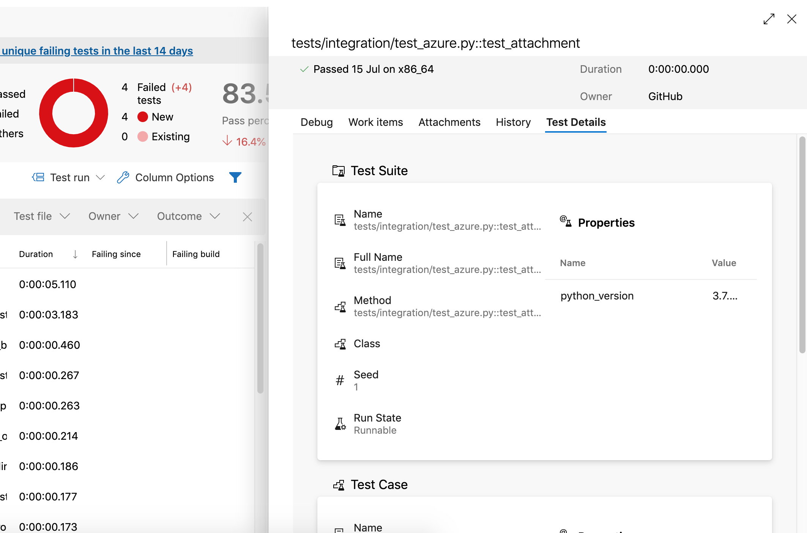
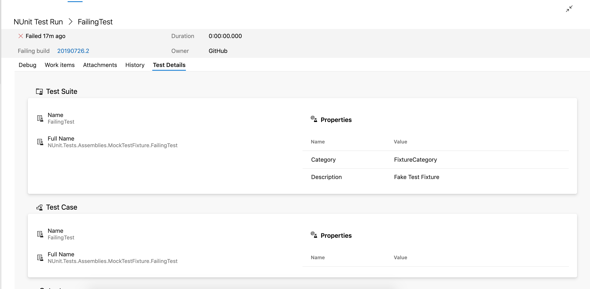
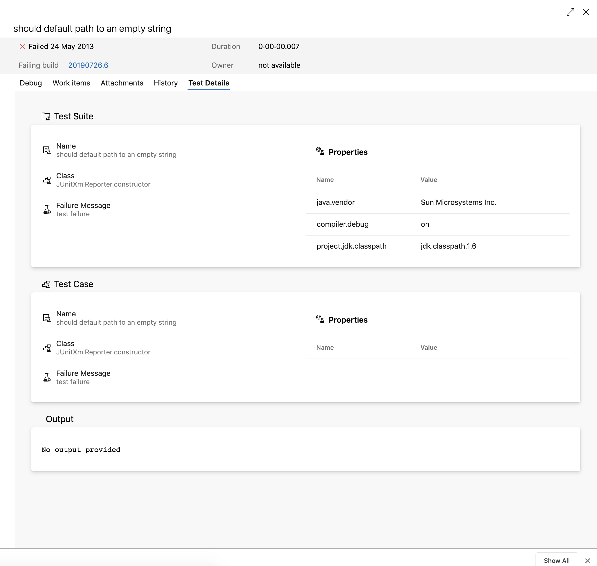

# vs-pytest

A UI extension for test cases in Azure DevOps (VSO)

Designed to be used with Pytest and [pytest-azurepipelines](https://github.com/tonybaloney/pytest-azurepipelines)

## Configuration

No additional configuration is required if you are using the `PublishTestResults@2` task with either the `NUnit` or `JUnit` test runner formats.

## Issues

If you come across any issues with this extension, please report them on the GitHub page. Attaching your report XML file to the issue will aid debugging.

## Screenshots

PyTest/pytes-nunit

NUnit 2.5

JUnit

